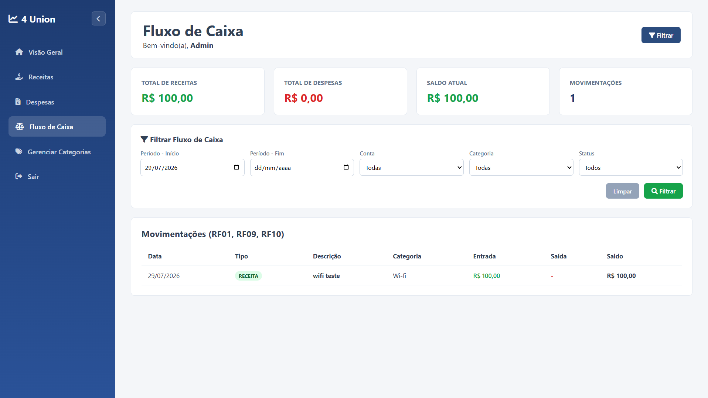
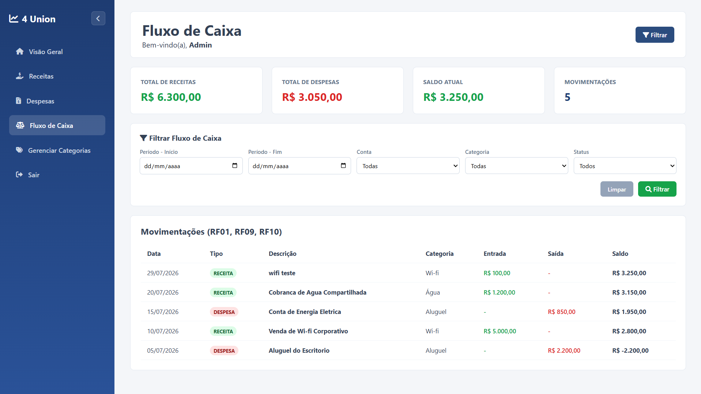

# Relatório da Sprint 08 — Fluxo de Caixa Inteligente

**Projeto:** Sistema Financeiro · 4 Union
**Turma:** TEC-INF-00041 — SENAI
**Equipe:** Letícia (Líder Técnico), Jhon (Programador), Filipe (Designer), Jacob (Banco de Dados e Analista)
**Data:** 29/07/2026

---

## Objetivo

Construir o Módulo Gerencial de Fluxo de Caixa, consolidando em uma única
visão os lançamentos já cadastrados nos módulos de Receitas e Despesas
(Sprints 05 a 07), calculando saldo em tempo real a partir dessas duas
fontes. Seguindo a regra de negócio definida no briefing da sprint, **nenhum
dado é digitado manualmente** nesta tela — tudo é herdado das tabelas
`receitas` e `despesas` já existentes.

## Funcionalidades implementadas

- **Consulta consolidada (SQL UNION ALL):** uma subquery une `receitas` e
  `despesas` em uma linha do tempo única, normalizando as colunas em
  `tipo`, `data`, `descricao`, `categoria`, `entrada` e `saida`.
- **Indicadores (KPIs):** Total de Receitas, Total de Despesas, Saldo Atual
  e número de Movimentações, calculados sobre o resultado filtrado.
- **Saldo acumulado:** calculado em PHP percorrendo o resultado em ordem
  cronológica crescente, com o saldo de cada linha refletindo o acumulado
  até aquele ponto no tempo. Na tela, a listagem é exibida do mais recente
  para o mais antigo (mesmo padrão das telas de Receitas/Despesas).
- **Filtros dinâmicos obrigatórios:** Período (data início/fim), Conta
  Financeira e Categoria.
- **Level Up (2 funcionalidades extras):**
  1. **Destaque visual** — valores de Entrada em verde e de Saída em
     vermelho, reaproveitando as classes `badge-receita` / `badge-despesa`
     já usadas nas outras telas.
  2. **Filtro por status** — "Concluído" (agrupa `Recebido` e `Pago`) ou
     "Pendente".
- **Novo item de menu** "Fluxo de Caixa" adicionado à sidebar em todas as
  telas do sistema (Dashboard, Receitas, Despesas, Categorias).

## Testes realizados

| Cenário | Resultado |
| --- | --- |
| Cadastrar receita e conferir reflexo no Fluxo de Caixa | ✓ Atualizado imediatamente |
| Cadastrar despesa e conferir reflexo no Fluxo de Caixa | ✓ Atualizado imediatamente |
| Conferir saldo acumulado matematicamente | ✓ Correto (validado linha a linha) |
| Filtrar por período | ✓ Lista filtrada corretamente |
| Filtrar por conta | ✓ Lista filtrada corretamente |
| Filtrar por categoria | ✓ Lista filtrada corretamente |
| Filtrar por status (Concluído/Pendente) | ✓ Lista filtrada corretamente |
| Tela sem nenhuma movimentação | ✓ Estado vazio exibido |

## Problemas encontrados

- Receitas e Despesas usam rótulos de status diferentes (`Recebido`/`Pendente`
  em Receitas, `Pago`/`Pendente` em Despesas), o que impediria um filtro de
  status único na visão consolidada.
- As duas tabelas têm nomes de coluna de data diferentes
  (`data_recebimento` vs. `data_pagamento`), exigindo normalização antes
  da união.

## Soluções adotadas

- O filtro de status foi consolidado em duas opções semânticas —
  "Concluído" (`status IN ('Recebido', 'Pago')`) e "Pendente" — em vez de
  expor os rótulos brutos de cada tabela.
- A subquery de consolidação usa `AS data`, `AS entrada` e `AS saida` para
  normalizar as duas origens antes do `UNION ALL`, permitindo ordenação e
  cálculo de saldo sobre um único conjunto de colunas.

## Capturas de tela

**Visão consolidada** — 5 movimentações (Receitas + Despesas), saldo acumulado
e cards de indicadores refletindo o cadastro em tempo real:

**Filtros aplicados** — painel de filtro (Período, Conta, Categoria, Status)
isolando a movimentação recém-cadastrada:

---

Sistema Financeiro 4 Union · Sprint 08 · Turma TEC-INF-00041
