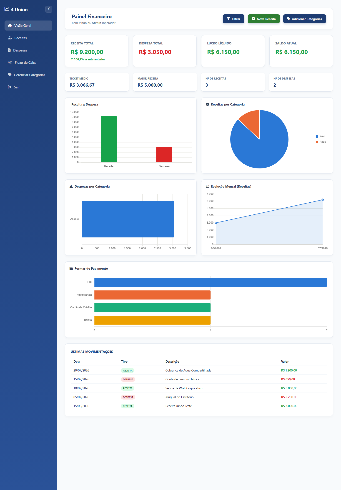
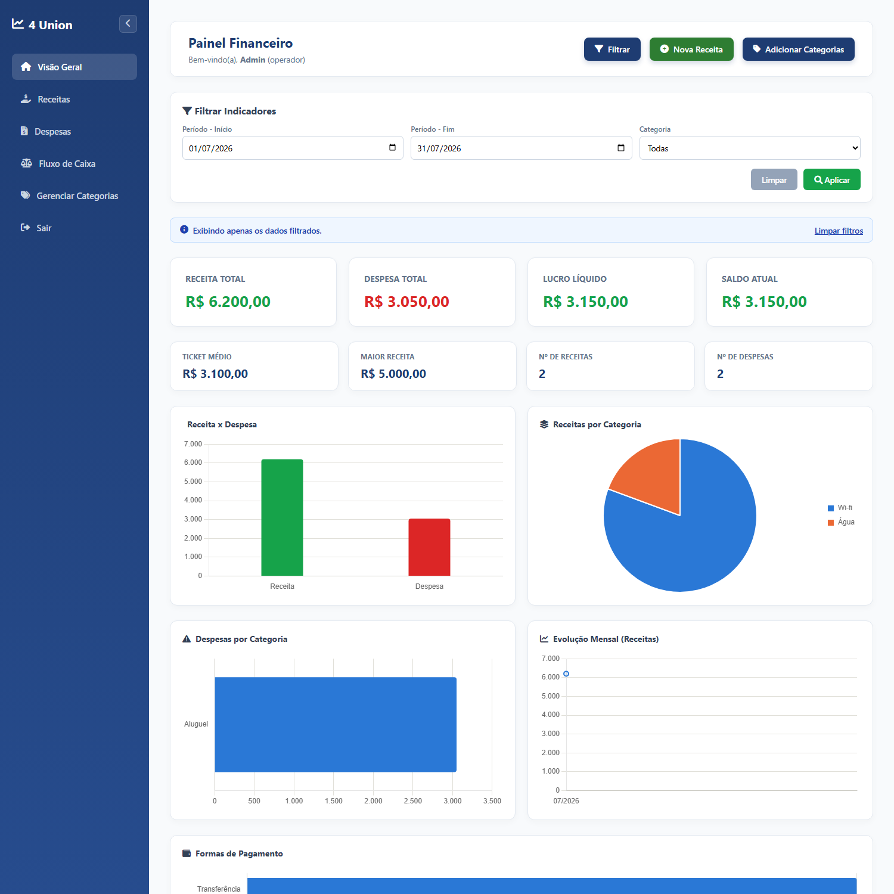
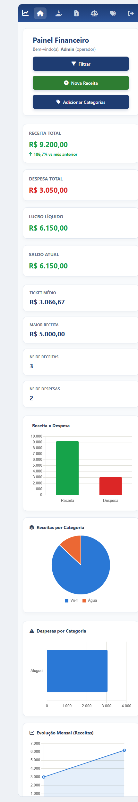

# Relatório da Sprint 09 — Business Intelligence (Finance Dashboard Pro)

**Projeto:** Sistema Financeiro · 4 Union
**Turma:** TEC-INF-00041 — SENAI
**Equipe:** Letícia (Líder Técnico), Jhon (Programador), Filipe (Designer), Jacob (Banco de Dados e Analista)
**Data:** 29/07/2026

---

## Objetivo

Evoluir o Painel Principal (`dashboard.php`), que até a Sprint 08 mostrava apenas
3 indicadores simples, para uma tela gerencial de Business Intelligence: 8 KPIs
estratégicos e 4 gráficos (Chart.js), todos calculados em tempo real a partir das
tabelas já existentes de Receitas e Despesas — sem nenhuma tabela nova e sem
digitação manual.

## KPIs implementados

| Grupo | KPI | Origem/Cálculo |
| --- | --- | --- |
| Volume | Receita Total | `SUM(valor)` em `receitas` |
| Volume | Despesa Total | `SUM(valor)` em `despesas` |
| Volume | Saldo Atual | Receita Total − Despesa Total |
| Performance | Lucro Líquido | Receita Total − Despesa Total |
| Performance | Ticket Médio | Receita Total ÷ Número de Receitas |
| Performance | Maior Receita | `MAX(valor)` em `receitas` |
| Operacional | Número de Receitas | `COUNT(*)` em `receitas` |
| Operacional | Número de Despesas | `COUNT(*)` em `despesas` |

Os 4 primeiros (Receita, Despesa, Lucro, Saldo) ficam nos cards de destaque
(Prioridade 1, leitura imediata); os outros 4 (Ticket Médio, Maior Receita,
Nº Receitas, Nº Despesas) em uma segunda fileira de cards secundários.

## Gráficos desenvolvidos (Chart.js)

1. **Receita x Despesa** (comparação) — barras verticais, verde/vermelho
   seguindo o mesmo padrão de cor já usado no resto do sistema.
2. **Receitas por Categoria** (distribuição) — gráfico de **pizza**, com o
   percentual de cada fatia no tooltip: mapeia as maiores fontes de
   faturamento e o peso de cada uma sobre o total.
3. **Despesas por Categoria** (comparação) — mesmo formato, aplicado às
   saídas: identifica os gargalos financeiros.
4. **Evolução Mensal** (tendência) — linha com os últimos 6 meses de receitas.
5. **Formas de Pagamento** (operacional) — contagem de uso de cada forma de
   pagamento, somando Receitas e Despesas.

Cobrem os três tipos pedidos na sprint — **barras, pizza e linhas** — e usam
uma paleta categórica de ordem fixa (nunca ciclada), para que a mesma
categoria mantenha sempre a mesma cor.

## Filtros dinâmicos (RF04, RF05)

O painel de filtros oferece **Período** (data inicial/final) e **Categoria**.
Os filtros valem para o dashboard inteiro — os 8 KPIs, os 5 gráficos e a lista
de Últimas Movimentações são recalculados sobre a mesma janela de dados, nunca
ficando dessincronizados entre si. Quando há filtro ativo, um aviso no topo
indica isso, com atalho para limpar.

**Level Up (2 funcionalidades extras, mínimo exigido):**
- **Crescimento Percentual (%):** compara o mês atual com o mês anterior para
  Receita e Despesa, exibido como badge com seta (▲/▼) nos cards de destaque.
- **Indicadores Coloridos:** Lucro Líquido e Saldo Atual ficam verdes quando
  positivos e vermelhos quando negativos.

## Dificuldades encontradas

- A "Matriz de Indicadores" pede 8 KPIs, mas o blueprint visual da sprint só
  reserva espaço para 4 cards de destaque — não havia lugar óbvio para os
  outros 4 sem quebrar a hierarquia visual proposta.
- Aplicar os filtros ao dashboard inteiro significava repetir a mesma condição
  em 13 consultas diferentes. Pior: Receitas e Despesas usam colunas de data
  com nomes distintos (`data_recebimento` × `data_pagamento`), e as consultas
  com `UNION` não aceitam o mesmo placeholder nos dois lados da união.
- O badge de Crescimento Percentual compara mês atual × mês anterior, o que
  entra em conflito lógico com um filtro de período escolhido pelo usuário.
- O cálculo de crescimento percentual pode gerar divisão por zero quando não
  há lançamentos no mês anterior (comum em uma base de dados nova/pequena).
- O gráfico de Evolução Mensal exibia todos os meses com o mesmo rótulo.

## Soluções adotadas

- Os 4 KPIs que não cabiam nos cards de destaque foram organizados em uma
  segunda fileira de cards menores, abaixo da fileira principal — todos os 8
  indicadores ficam visíveis sem disputar espaço com os 4 prioritários.
- Os filtros são montados uma única vez por duas funções auxiliares
  (`montarFiltroSql` e `montarFiltroParams`), que recebem a coluna de data e um
  sufixo opcional para o placeholder. Assim a mesma regra atende Receitas e
  Despesas e funciona dentro dos `UNION`, sem duplicar código — atendendo ao
  princípio de "Arquitetura Escalonável → Código Reutilizável" da sprint.
- O badge de crescimento é ocultado quando há filtro de período ativo, já que
  nesse caso a comparação mês a mês perderia o sentido.
- O cálculo de crescimento só é executado (e o badge só aparece) quando o mês
  anterior tem valor maior que zero, em vez de mostrar um erro ou "infinito".
- O rótulo repetido era um bug de data: `DateTime::createFromFormat('Y-m', ...)`
  completa a data com o **dia de hoje**, e em um dia 31 os meses de 30 dias
  transbordavam para o mês seguinte. Corrigido fixando o dia em `01`.

---

## Capturas de tela

**Dashboard completo** — os 8 KPIs (4 cards de destaque + 4 secundários), os
5 gráficos e a lista de Últimas Movimentações:

**Filtros aplicados (RF04, RF05)** — período de 01/07 a 31/07: os KPIs caem
de R$ 9.200,00 para R$ 6.200,00 e todos os gráficos são recalculados sobre a
mesma janela:

**Layout responsivo** — o mesmo dashboard em largura de celular (390px): a
barra lateral vira uma faixa de ícones no topo, os cards empilham e os
gráficos se redimensionam, sem rolagem horizontal:

---

Sistema Financeiro 4 Union · Sprint 09 · Turma TEC-INF-00041
